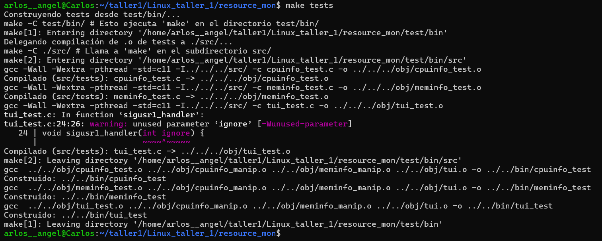
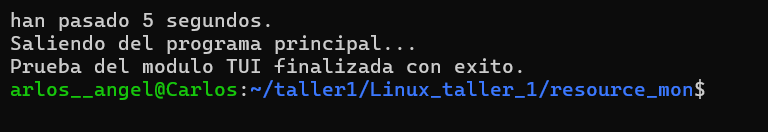

# Linux_taller_1

## Integrantes:
* Carlos S. Rangel | 1005065786
* Valeria Garcia Rodas | 1192801328
---

En este proyecto se incluye el programa **resource_mon**  que lee la información del SO relacionada con:
* Nombre y fabricante de la CPU del sistema
* Número de núcleos y número de hilos (núcleos reales + núcleos virtuales) y el porcentaje de uso de cada hilo

* Cantidad de memoria físisca instalada en el sistema en MB
* Cantidad de memoria de intercambio (swap) en MB del sistema
* Porcentaje de uso de la memoria física instalada
* Porcentaje de uso de la memoria de intercambio

Este programa se ejecuta hasta que el usuario presione la letra **q**, presione **ctrl + c** , o cierre la **tty** en la que se está ejecutando el programa.

La información de la(s) CPU(s) se actualiza e imprime  los datos obtenidos cada segundo y los muestra por interfaz de linea de comandos en una ventana de texto fija.

## construccion del programa
En la carpeta raiz del proyecto "resource_mon" podemos ejecutar los siguientes comandos:

* make clean  
Este comando limpará automaticamente todos los ejecutables actuales dentro del proyecto.

* make resource_mon  
Este comando construirá únicamente el programa principal, y lo guarda en ./bin/resource_mon

* make tests  
Este comando construye los ejecutables de test y tambien los guarda en la carpeta /bin del directorio raiz.

* make all 
Este comando contruye los ejecutables del programa principal y de test simultaneamente.

---

## Resultados de ejecucion
**./bin/resource_mon** 

**./bin/cpuinfo_test**

**./bin/meminfo_test**

**./bin/tui_test**

